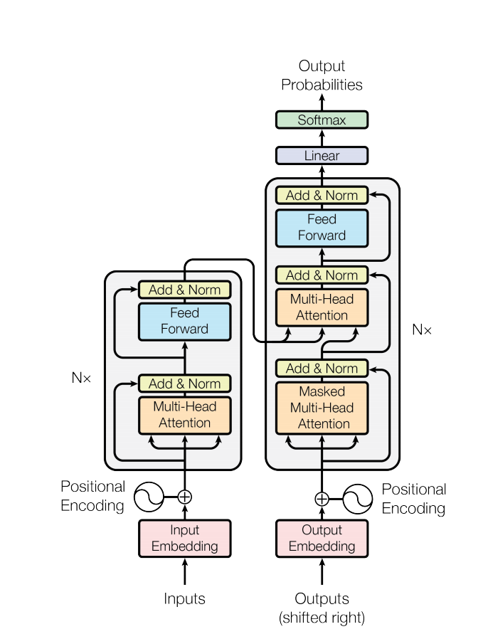
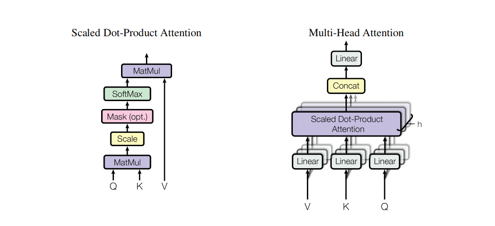

# 论文阅读

## LORA: LOW-RANK ADAPTATION OF LARGE LANGUAGE MODELS

背景：大模型参数微调困难，现有技术通过扩展模型深度或减少模型的可用序列长度，在模型质量和效率间做平衡

## Attention Is All You Need

Transformer

1. Multi-Head Attention
2. layer-Norm
3. Feed Forward
4. Positional Encoding

attention function