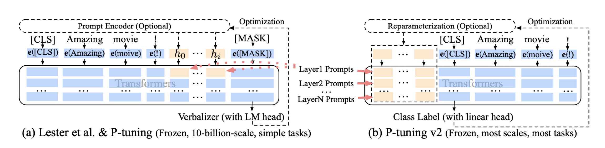

[TOC]

# 大模型

## Attention Is All You Need

2017 NIPS

1. Multi-Head Attention
2. Scaled Dot-Product Attention
3. Layer-Normalization
4. residual connect
5. Encoder and decoder stacks
6. Position-wise Feed-Forward Networks
7. Positional Encoding
8. Masked Multi-Head Attention

## BERT: Pre-training of Deep Bidirectional Transformers for Language Understanding

* **B**idirectional **E**ncoder **R**epresentations from **T**ransformers: 多个Transformer的编码器堆叠，深层Transformer

* Two kinds of tasks:
  1. **sentence-level tasks**: natural language inference, paraphrasing
  2. **token-level tasks**: named entity recognition, question answering

* pre-training approaches:
  1. Unsupervised Feature-based Approaches
  2. Unsupervised Fine-tuning Approaches
  3. Transfer Learning from Supervised Data(Computer vision)

* two phases of BERT: pre-training and fine-tuning

* BERT’s **model architecture** is a multi-layer bidirectional Transformer en- coder based on the original implementation

* Masked LM, Next Sentence Prediction

## Improving Language Understanding by Generative Pre-Training

**G**enerative **P**re-**T**raining：

* two stages：1. learning a high-capacity language model on a large corpus of text.(**Unsupervised pre-training**) 2. adapt the model to a discriminative task with labeled data.(**Supervised fine-tuning**)

* Unsupervised pre-training:

  * 最大化似然函数（已有前k个token和模型参数预测下一个token）训练模型时的损失函数
    $L_{1}(\mathcal{U})=\sum_{i} \log P\left(u_{i} \mid u_{i-k}, \ldots, u_{i-1} ; \Theta\right)$
  * $h_0=UW_e+W_p$
    $h_l=transformer_block(h_{l-1})\forall i \in[1, n]$
    $P(u)=softmax(h_nW_e^T)$

* Supervised fine-tuning：

  * 微调根据打标签的数据最大化目标函数：

    $P\left(y \mid x^{1}, \ldots, x^{m}\right)=\operatorname{softmax}\left(h_{l}^{m} W_{y}\right)$
    $L_{2}(\mathcal{C})=\sum_{(x, y)} \log P\left(y \mid x^{1}, \ldots, x^{m}\right)$

# 微调

## Prefix-Tuning：Optimizing Continuous Prompts for Generation

**Prefix-Tuning**

* 是后续读的几个论文的微调方法中（Prefix-Tuning、P-Tuning、Prompt-Tuning），最优先提出的。在Prefix-Tuning提出前，微调还是要修改语言模型所有的参数，并且针对每一个任务需要存储复制全部的参数。Prefix-Tuning学习的参数少（0.1%）能达到和全数据微调（full data setting）想近似效果，并远优于少数据微调（low-data settings），在推断未在训练集中出现的样例时有更好的效果。先前的是使用adapter-tuning，预训练大模型每层加入adapter，微调大约3.6%的大模型参数。大致思想是加入一组可以微调的prompts，然后在训练的时候冻结预训练语言模型的参数只训练这组参数。
* 微调包含两种：
  1. BERT+finetuning
  2. 对大模型进行微调ChatGLM

* NLP 任务的发展分为四个阶段即 NLP 四范式：

  1. 第一范式：基于传统机器学习模型的范式，如 tf-idf 特征 + 朴素贝叶斯等机器算法；

  2. 第二范式：基于深度学习模型的范式，如 word2vec 特征 + LSTM 等深度学习算法，相比于第一范式，模型准确有所提高，特征工程的工作也有所减少；

  3. 第三范式：基于预训练模型 + finetuning 的范式，如 BERT + finetuning 的 NLP 任务，相比于第二范式，模型准确度显著提高，但是模型也随之变得更大，但小数据集就可训练出好模型；

  4. 第四范式：基于预训练模型 + Prompt + 预测的范式，如 BERT + Prompt 的范式相比于第三范式，模型训练所需的训练数据显著减少。
     * prompt-learning和fine-tuning两种思路。fine-tuning是针对下游任务，使用特定数据集对模型进行修改。prompt-learning在尽量少地改变模型的情况下，通过给输入提供“提示信息”，将下游任务转化为完形填空或者文本生成任务，充分挖掘预训练模型学到的知识。

* 对Transformer解码器深度结构LM的**Fine-tuning**，最大化对数似然函数：$\max _{\phi} \log p_{\phi}(y \mid x)=\sum_{i \in \mathrm{Y}_{\mathrm{idx}}} \log p_{\phi}\left(z_{i} \mid h_{<i}\right) .$

* Prefix-Tuning：$z=[\text { PREFIX } ; x ; y]$，在前面加一个类似上下文提示向量，但不对应具体某个具体的词，在prefix-tuning过程中，训练得到prefix的矩阵$P_\theta$，后面所有的LM参数都固定不变

* Prefix-Tuning相较于Fine-Tuning，需要训练的参数仅有针对文本生成任务的continuous prefix，修改的参数小了1000倍。在full data setting下与FT相当，在low-data远超FT。但训练时间相较于FT并没有短很多（缩短了大概40%？）。

## GPT Understands, TOO

**P-Tuning v1**

*   摘要：

    *   在之前以往都认为GPT在处理NLU（NLP领域核心两个问题：NLU和NLG）方面效果差，不如BERT的发展线。

    *   已有的GPT3在人工选的prompt下也能在NLU任务中取得很好的效果。

    *   同年或去年的文章聚焦于如何去自动寻找离散的prompt，但是因为神经网络的连续性，没有办法应用进来。

    *   本文通过在连续空间内找到prompts，来将GPTs和NLU应用相关联。

*   相比于人为去找合适的Prompt（细微的差别可能导致效果相差巨大，不与人类直觉一致），以及用具体的词去表示

    $\left\{\mathbf{e}\left(\left[\mathrm{P}_{0: i}\right]\right), \mathbf{e}(\mathbf{x}), \mathbf{e}\left(\left[\mathrm{P}_{i+1: m}\right]\right), \mathbf{e}(\mathbf{y})\right\}$，P-tuning将prompt用pseudo tokens（连续向量，并非具体的某个现实词）来表示，$\left\{h_{0}, \ldots, h_{i}, \mathbf{e}(\mathbf{x}), h_{i+1}, \ldots, h_{m}, \mathbf{e}(\mathbf{y})\right\}$

    $\hat{h}_{0: m}=\underset{h}{\arg \min } \mathcal{L}(\mathcal{M}(\mathbf{x}, \mathbf{y}))$

*   为了解决$h$的Discreteness问题（预训练模型的原始embedding在预训练后已经变得高度离散。 如果提示模板随机分布初始化，然后用随机梯度下降 (SGD) 进行优化，已经证明只改变小邻域的参数，优化器很容易陷入局部最小值）和Association问题（prompt tokens应该是互相关联的而不是独立的），使用带有MLP的LSTM来生成$h$，最终虽然也需要训练MLP的参数，但参数规模远远小于微调需要修改的参数量

*   与Prefix-Tuning的区别：

    *   prefix-tuning仅在句子前加prompt tokens然而p-tuning可以在任何位置加
    *   prefix-tuning需要对网络中每一层都额外concat 连续的prompt tokens，因为仅在输入层加没效果，而P-tuning是non-invasively地仅在输入层加入了连续的prompts
    *   prefix-tuning设计之初仅针对NLF任务和GPTs，而P-tuning针对NLU任务和所有的语言模型

## Learning How to Ask: Querying LMs with Mixtures of Soft Prompts

**Deep Prompt Tuning**
**Soft Prompts**

与GPT-Understand TOO和Prefix-Tuning：Optimizing Continuous Prompts for Generation同时间发布

*   摘要
    *   自然语言的提示可以引导预训练语言模型完成一些其他的下游任务
    *   利用梯度下降的方式去学习prompt的表达形式
    *   给出了一种软词汇的prompt形式即prompt本身是连续的向量而不是语言模型的的词的embeddings
    *   优化了prompt的混合，以学习出更有效的prompt和他们的组合方式
    *   预训练后的语言模型的知识储备时被低估的

*   属于soft prompts，类似于P-Tuning v1

## The Power of Scale for Parameter-Efficient Prompt Tuning

**Prompt Tuning**

## P-Tuning v2: Prompt Tuning Can Be Comparable to Fine-tuning Universally Across Scales and Tasks

**P-Tuning v2**

*   fine-tuning - Prompting - Prompt tuning

*   Abstract：

    *   P-Tuning v2概念上取自Prefix-tuning(Prefix-Tuning：Optimizing Continuous Prompts for Generation)以及Deep Prompt Tuning(Learning how to ask: Querying lms with mixtures of soft prompts)，在这两者基础上的优化和实现。
    *   具体是不同于Deep Prompt Tuning仅在输入层将具体的词替换成连续的prompt tokens，PTv2在预训练模型每一层都加入连续的prompt tokens。
    *   在300M到10B的参数规模的模型上取得了很好的效果（针对简单文本分类或复杂一些的序列标注任务）

    *   以前的prompt tuning在模型参数规模超过10B的时候能与fine-tuning有相当的效果，但对更小规模的模型效果较差（100M到1B）
    *   PTv1以及prefix-tuning在NLU的部分任务上有显著的效果，但在**sequence tagging**（序列标注）任务上的有效性未被验证。

*   Experiments

    *   NLU: SuperGLUE(general NLU ability)
    *   Sequence Labeling Tasks: named entity recognition, extractive Question Answering and semantic role labeling

*   总结：把prefix-tuning和deep prompt结合到了一起，对transformer的每一层添加了前缀可训练参数。针对特定下游任务训练一个soft-prompt嵌入到模型中

    

## LORA: LOW-RANK ADAPTATION OF LARGE LANGUAGE MODELS

**LoRA**

*   在LoRA以前还是主要以添加adapters为主，adapters的方案通过给transformer添加新的adapt layer的方式，加大了推理延迟。prefix-tuning存在优化参数结果非线性问题，并且prefix-tokens占据了一部分输入tokens长度，使下游任务的可用输入tokens变少。
*   尽管预训练模型的参数量很大，但每个下游任务对应的本征维度并不大（Intrinsic Dimension）并不大。原本需要对整个参数矩阵W进行梯度更新，将W分解为两个维度小的矩阵相乘的形式$W_0=UV$，维度$r \ll k$，参数优化规模从$k \times k$变成了$2 \times k \times r(where\quad r \ll k)$

*   LoRA和P-Tuning微调的方式不同，互相垂直，可以一起使用

# 待读

## pretraining language models with human preference

条件训练主要是教LM学习根据它们的人类偏好分数(由奖励模型给出)在Tokens上的分布。得到的结果出奇的好，条件训练将不良内容的发生率降低了一个数量级，无论是在没有提示的情况下生成还是在对抗性选择的提示下生成时。

此外，条件训练在任务特定微调之前和之后都保持了标准LM预训练的下游任务性能。与标准LM预训练相比，使用人工反馈进行预训练的偏好满意度要高得多，然后根据反馈进行微调。

## Multimodel Chain-of-Thought Reasoning in Language Models

作者介绍了**「一种突破性的大型语言模型（LLM）新方法，该方法结合了文本和视觉以实现更好的推理性能」**。这个新模型被称为Multimodal-CoT，它建立在思维链(CoT)方法的基础上，以生成中间推理链作为推断答案的基本原理。最大的不同之处在于，这一次，该模型将语言和视觉(图像)模式合并到一个两阶段框架中，将基本原理生成和答案推断分开。

## The Wisdom of Hindsight Makes Language Models Better Instruction Followers

在本文中，作者深入研究了强化学习在微调语言模型中的应用。具体来说，他们探索了**「“人类反馈强化学习(RLHF)”算法，该算法在通过人类反馈将GPT系列模型与指令对齐方面取得了显著的成功」**。

## Crawling The Internal Knowledge-Base of Language Models

作者提出了**「一种从给定语言模型中提取事实知识图谱的新方法」**。他们首先“爬取”语言模型的内部知识库，并围绕种子实体扩展知识图。爬行过程被分解为子任务，通过特殊设计的提示来实现，以确保高精度和召回率。

## DetectGPT: Zero-Shot Machine-Generated Text Detection using Probability Curvature

**「在本文中，作者解决了检测机器生成文本的问题，随着大型语言模型(LLMs)的发展，这个问题变得越来越困难」**。这些模型非常擅长生成文本，以至于越来越难以分辨一篇文章是由人类还是机器生成的。例如，学生可以使用这些模型来完成他们的写作作业，这使得教师更难评估他们的工作。
